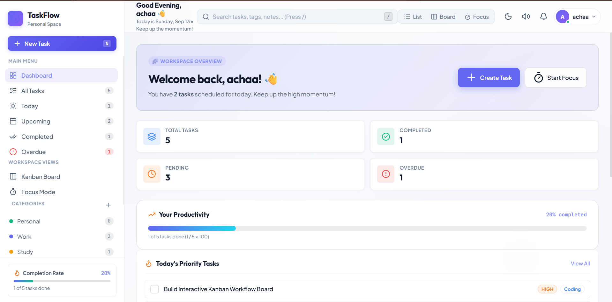
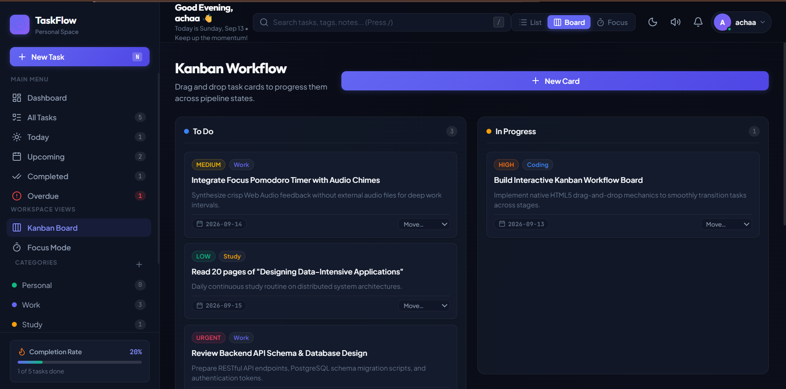
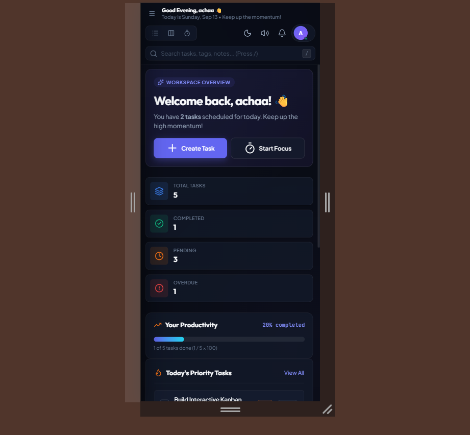
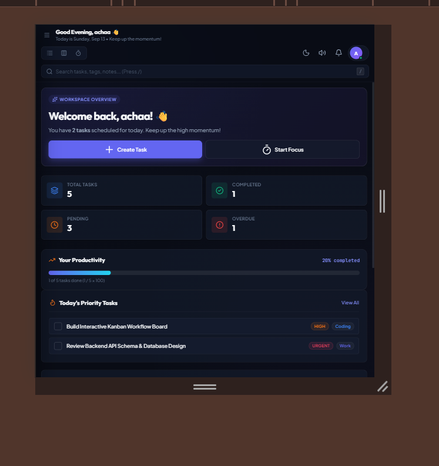

# TASKFLOW

> A modern, minimalist task management application built with vanilla HTML5, CSS3, and JavaScript ES6+. No frameworks, no build tools, no backend.

**[Live Demo →](https://ucokkk6173.github.io/TaskFlow/)** · **[Repository →](https://github.com/ucokkk6173/TaskFlow)**

---

## Screenshots

### Dashboard — Light Mode



### Kanban Board



### Mobile View



### Tablet View



---

## Features

| Feature | Description |
|---|---|
| **Task CRUD** | Create, edit, delete tasks with title, description, priority, category, status, due date, and due time |
| **Subtasks** | Add checklist items within each task, track completion progress |
| **Search** | Real-time search across titles, descriptions, categories, and subtask text |
| **Filter** | Status tabs (All, Active, Completed, Today, Upcoming, Overdue) and category dropdown |
| **Sorting** | 6 sort options: Newest, Oldest, Priority High→Low, Priority Low→High, Deadline nearest, Deadline latest |
| **Category** | Create custom categories with color accents, filter tasks by category |
| **Priority** | 4 levels: Urgent, High, Medium, Low — color-coded badges |
| **Deadline** | Due date and time with overdue detection |
| **Dashboard** | Productivity metrics, progress bar, today's priorities, category breakdown |
| **Kanban Board** | Drag-and-drop columns: To Do, In Progress, Completed |
| **Pomodoro** | Focus timer with 25/5/15 minute modes, circular SVG progress, audio chimes |
| **Dark / Light Mode** | Theme toggle persisted to localStorage |
| **Keyboard Shortcuts** | N (new task), / (search), 1-4 (views), T (theme), ? (shortcuts), Esc |
| **Toast Notifications** | Feedback on every action with auto-dismiss |
| **Responsive Design** | Mobile, tablet, and desktop layouts |
| **Settings** | User profile, greeting style, sound toggle, confetti toggle |
| **Export / Import** | Backup and restore workspace data as JSON |
| **localStorage** | All data persisted client-side, no backend required |

---

## Tech Stack

| Layer | Technology |
|---|---|
| Structure | HTML5 semantic markup |
| Styling | CSS3 — Custom Properties, Grid, Flexbox, animations |
| Logic | Vanilla JavaScript ES6+ (class-based architecture) |
| Storage | localStorage |
| Icons | Lucide Icons (CDN) |
| Fonts | Plus Jakarta Sans, Outfit, JetBrains Mono (Google Fonts) |
| Effects | canvas-confetti (CDN) |
| Audio | Web Audio API — synthesized chimes, no external audio files |

---

## Getting Started

**Option 1 — Direct open:**

Clone or download, then open `index.html` in any modern browser.

**Option 2 — Local server (optional):**

```bash
# Using Node.js
npx serve .

# Using Python
python -m http.server 8000
```

---

## Project Structure

```
TaskFlow/
├── index.html
├── style.css
├── script.js
├── README.md
├── assets/
│   ├── icons/
│   │   └── favicon.svg
│   └── screenshots/
│       ├── dashboard-desktop.png
│       ├── dashboard-light.png
│       ├── dashboard-mobile.png
│       ├── dashboard-tablet.png
│       └── kanban-desktop.png
└── .gitignore
```

---

## Architecture

The application is organized into four classes:

| Class | Responsibility |
|---|---|
| `TaskRepository` | Data layer — localStorage CRUD operations for tasks and categories |
| `SoundService` | Web Audio API synthesizer for completion, pop, and trash chimes |
| `PomodoroService` | Timer engine — session tracking, mode switching, tick notifications |
| `TaskFlowApp` | Main controller — UI rendering, event handling, state management |

State is managed through class properties and synchronized across all views on every `render()` call.

---

## Responsive Design

The UI adapts across all screen sizes:

- **Mobile** — collapsible sidebar drawer, bottom-sheet modals, scrollable filter tabs, touch-friendly task cards
- **Tablet** — two-column Kanban, adjusted spacing
- **Desktop** — full sidebar, multi-column metrics, drag-and-drop Kanban

---

## Accessibility

- `aria-label` on interactive elements (buttons, navigation, modals)
- `aria-hidden` on modals and overlay elements
- `aria-expanded` on toggle buttons (sidebar, dropdowns)
- `role="dialog"` and `aria-modal` on modal dialogs
- Keyboard navigation with focus trap in modals
- `:focus-visible` outlines on all interactive elements
- `prefers-reduced-motion` support — animations disabled for users who prefer reduced motion
- `prefers-contrast: high` support — enhanced borders for high contrast mode
- Semantic HTML (`<nav>`, `<main>`, `<aside>`, `<header>`, `<section>`)

---

## Current Scope

This is a **frontend-only** portfolio project.

- All data is stored in the browser's `localStorage`
- No backend, no database, no API, no authentication
- Single-user, client-side only

---

## Future Development

The following are planned enhancements, **not** currently implemented:

- Backend API with database persistence
- User authentication and multi-user support
- Real-time collaboration
- Due date reminders and push notifications
- Task attachments and file uploads
- Progressive Web App (PWA) offline support
- Internationalization (i18n)

---

## What This Project Demonstrates

Building TASKFLOW reinforced practical skills across the full frontend stack:

- **DOM manipulation** — dynamic rendering of tasks, kanban cards, modals, and dashboard widgets
- **Event handling** — click, input, drag-and-drop, keyboard shortcuts, and global listeners
- **State management** — class-based state with centralized render cycle
- **Data persistence** — localStorage read/write with fallback and error handling
- **Responsive layout** — CSS Grid, Flexbox, media queries, mobile-first approach
- **UI/UX design** — modal management, toast notifications, empty states, loading states
- **Filtering & sorting** — multi-criteria filtering with combined search, category, and status
- **Kanban interaction** — drag-and-drop with keyboard-accessible alternative (move select)
- **Pomodoro timer** — interval-based timer with SVG progress and Web Audio API
- **Theme system** — CSS custom properties for dark/light mode with localStorage sync
- **Accessibility** — ARIA attributes, focus management, reduced-motion, high contrast support
- **Git workflow** — incremental commits, version control, GitHub Pages deployment

---

## Portfolio Value

This project demonstrates the ability to:

- Build a complete, polished single-page application without frameworks
- Implement complex interactive features (drag-and-drop, real-time filtering, timer)
- Create responsive layouts that work across mobile, tablet, and desktop
- Write maintainable, well-organized vanilla JavaScript with class-based architecture
- Handle client-side data persistence and state synchronization
- Deliver a production-quality UI with attention to accessibility and usability

---

## Browser Support

Tested on Chrome 90+, Firefox 90+, Safari 14+, and Edge 90+. Requires ES6+ support.

---

## License

Open source — available for portfolio demonstration purposes.
